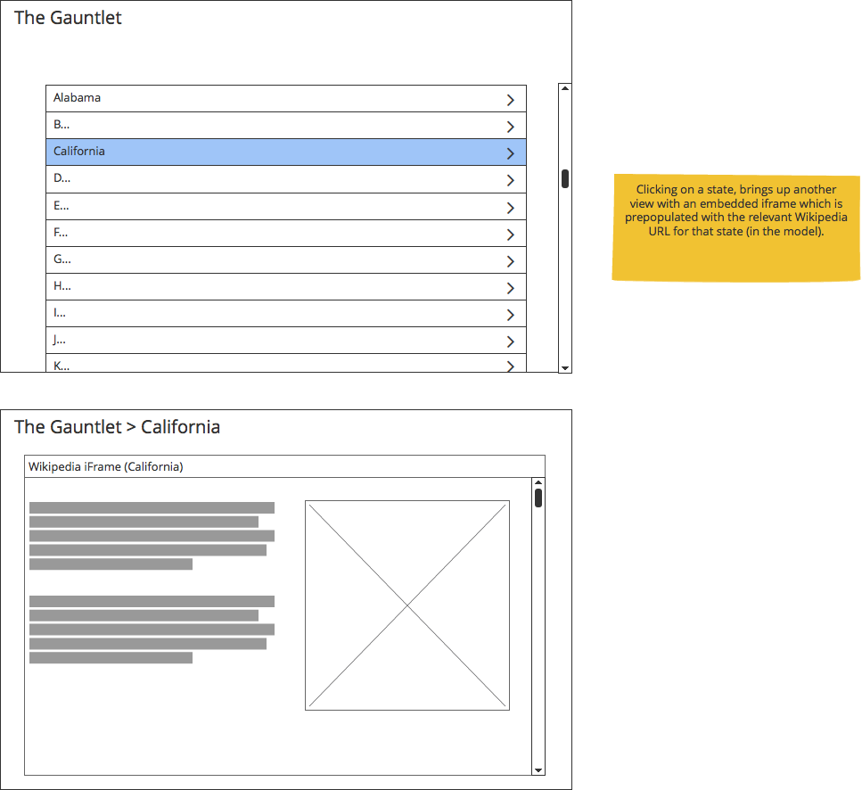

# The Gauntlet

Welcome! Congratulations on making our shortlist! Below you will find a task that will put your skills to the test. Good luck.

##### The following are system software requirements:

* [Docker Community Edition](https://www.docker.com/community-edition)
* [NodeJS](https://nodejs.org/)
* [NPM](https://www.npmjs.com/)

##### The following are steps required to setup the `SeverApp`

1. `cd TheGauntlet_ServerApp` 
2. `npm install`
3. run `DockerBuildDockerComposeUp.sh` in the `docker` folder
4. access `http://localhost:4895/api/v1/state` and see if you get a list of American States in `json` format

The ServerApp hosts base url is `http://localhost:4895/api/v1` & the American States API is therefore `http://localhost:4895/api/v1/state`. There are two API endpoints being provided by the service:

1. `http://localhost:4895/api/v1/state` will return **all** the results
2. `http://localhost:4895/api/v1/state/:stateId` is a route that will return only one state, as per the specified `stateId`. This is provided in the State data model

##### State Data Model

    {
      "_id": "5af1c289a1858000106a271d",
      "name": "Alabama",
      "wikipediaUrl": "https://en.wikipedia.org/wiki/Alabama"
    }

##### Response Model - Multiple states 
Truncated to 5, to save space in this README. It's the full 50 in the database

    {
      "data": {
        "success": true,
        "states": [
          {
            "_id": "5af1c289a1858000106a271d",
            "name": "Alabama",
            "wikipediaUrl": "https://en.wikipedia.org/wiki/Alabama"
          },
          {
            "_id": "5af1c289a1858000106a271e",
            "name": "Alaska",
            "wikipediaUrl": "https://en.wikipedia.org/wiki/Alaska"
          },
          {
            "_id": "5af1c289a1858000106a2721",
            "name": "California",
            "wikipediaUrl": "https://en.wikipedia.org/wiki/California"
          },
          {
            "_id": "5af1c289a1858000106a2739",
            "name": "New Hampshire",
            "wikipediaUrl": "https://en.wikipedia.org/wiki/New_Hampshire"
          },
          {
            "_id": "5af1c289a1858000106a273a",
            "name": "New Jersey",
            "wikipediaUrl": "https://en.wikipedia.org/wiki/New_Jersey"
          }
        ],
        "count": 5
      },
      "code": 200,
      "message": "Successful retrieved all the states"
    }

##### Response Model - Single state

    {
        "data": {
            "success": true,
            "state": {
                "_id": "5af1c289a1858000106a271d",
                "name": "Alabama",
                "wikipediaUrl": "https://en.wikipedia.org/wiki/Alabama"
            }
        },
        "code": 200,
        "message": "Successful retrieved specified state"
    }

## What is required of you - `ClientApp`

It is incumbent upon you to initialise a Framework-based project. This is typically done with a CLI tool, many of the major frameworks include or offer a CLI tool.  

Step into the `ClientApp` directory (`cd ClientApp/`). You will notice that this is an empty folder. It is within this folder that you should initialise the project.

##### Take a look a look at this mock-up
 

## Application Requirements

1. A "data service" that makes HTTP calls to the service you should be running locally. 
    * You should expose methods to your components, such as `getStates` for your list
    * Never call APIs directly from components (decoupling)
    * Use of Observables will be rewarded
2. Navigation Router
    * Each major framework includes one
    * An implementation will be required for the completion of this test
3. Landing Page (Component) - URL: `http://locahost:1234/`
    * This should be the page that is landed on first when accessing the base URL of the app
    * it should have a header & a list of American States
4. Header Component
    * Should display the text The Gauntlet on the landing page
    * Should include the State name on the State page
    * Re-use of this component will be rewarded
5. A List Component
    * This should display the complete list of American States
    * Use of a loading spinner will be rewarded, even though we are working locally :)
    * Each item should be clickable. Upon clicking an item, the user should be routed to the "State Page"
6. State Page (Component) - URL: `http://locahost:1234/:stateId`
    * Your router should lead you here. The State ID (which is a MongoDB id) should be the URL Parameter
    * Should have the same Header Component used on the Landing Page
    * Should have the current State name in the header, appended to the original title
    * An IFrame component should be created. It should load the Wikipedia page associated to the state
7. Stying
    * you may apply a CSS framework if you wish, points will be awarded for a pleasant looking presentation
    * use of a preprocessor such as SASS or LESS will be rewarded 
    
Port number used here are just examples, your app can be hosted on any port you choose. 

#### You may choose from the following frameworks to accomplish the test

1. [Angular (versions 2 - 6)](https://angular.io/)
2. [ReactJS](https://reactjs.org/)
3. [VueJS](https://vuejs.org/) :fire:

##### Git & Committing

Please be sure to "show your working out" by committing as much as possible. 
Even though you could create one commit for the entire solution, this is discouraged. 
We would like to see the steps/process you used to arrive to your solution.

## Why do this for us?

Completing this test will help us understand to what degree you satisfy the following criteria:

1. Aptitude, can you accomplish the task set forth using the Power of the Internet?
2. Precision, can you edit just what needs to be edited in order to accomplish your goals?
3. Attention, can you follow the guide set forth by the architect?
4. Communication and expectation management, for us, should you be on course to default on your allotted timeframe along with outlining any hurdles that arise

## Who to ask for help

* [Luke Johnstone luke@touchfoundry.co.za](mailto:luke@touchfoundry.co.za)

# Good luck & thanks!# clientapp
